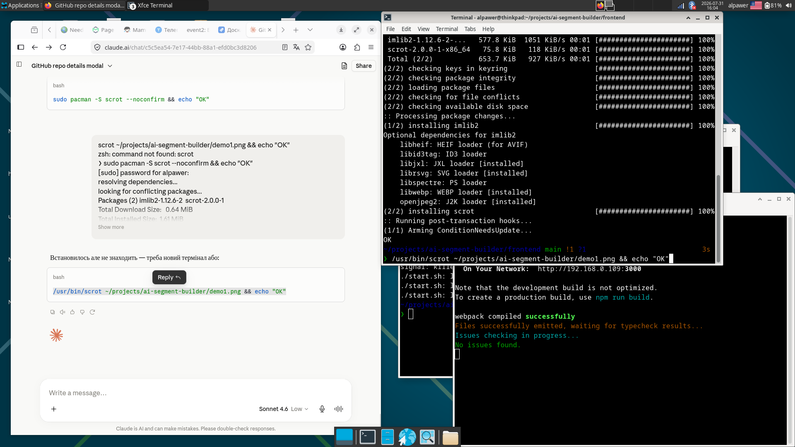
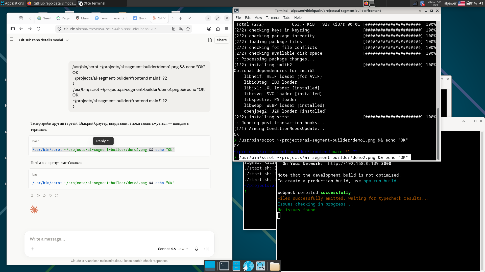
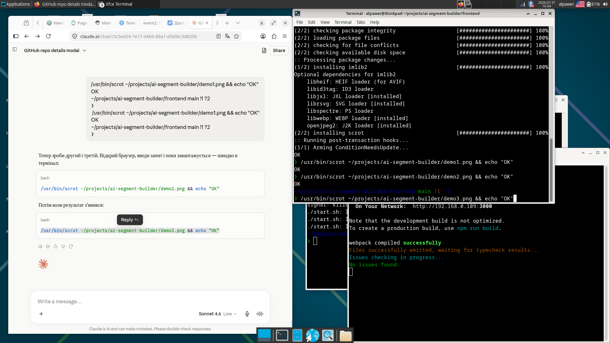

# AI Segment Builder

A demo project that converts natural language queries into contact segment filters using Claude AI.

Describe your audience in any language — AI will build the filter tree automatically.

## Demo

## How it works

1. User types a natural language query (in any language)
2. The backend sends it to Claude AI with a structured prompt
3. Claude returns a JSON filter tree
4. The frontend renders the filters visually

## Tech Stack

- **Backend**: Go + Anthropic SDK
- **Frontend**: React + TypeScript
- **AI**: Claude claude-sonnet-4-6 via Anthropic API

## Getting started

You'll need Go 1.21+, Node.js 18+, and an Anthropic API key from [console.anthropic.com](https://console.anthropic.com).

    git clone https://github.com/alpawer/ai-segment-builder.git
    cd ai-segment-builder
    cp backend/.env.example backend/.env
    # Add your ANTHROPIC_API_KEY to backend/.env
    cd frontend && npm install && cd ..
    ./start.sh

Open http://localhost:3000

## Example queries

- contacts from USA created in the last 7 days
- customers with more than 5 orders and lifetime value over 100
- нові контакти з України за останній місяць

## Project Structure

    ai-segment-builder/
    ├── backend/        # Go server, Anthropic SDK, /api/suggest endpoint
    ├── frontend/       # React + TypeScript UI
    └── start.sh        # runs both with one command
